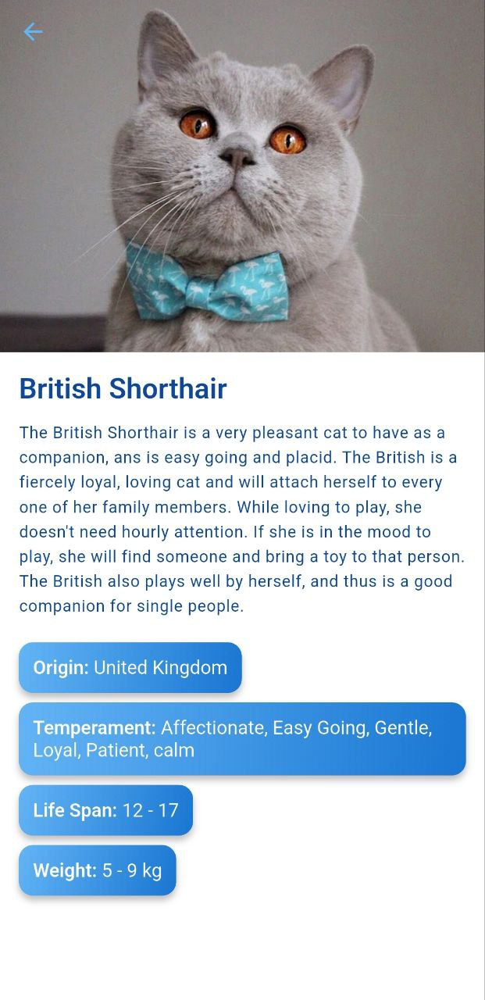

# cat_tinder

HSSE MIPT Flutter course HomeWork

## About

Simple Flutter app which allows you to swipe cats in "Tinder-like" form.

## Features

1. Random cats on main screen
2. Swipe left - dislike, swipe right - like
3. Swipe counter
4. Buttons with swipe functionality
5. Detail screen: info about breed and full info
6. New cats loading on end of current
7. Liked cats screen
8. Adding and deleting cats from liked (stored in Runtime)
9. Instant filter in liked
10. Proper error handling
11. Progress bars
12. Saving likes (with all data) from time exited to time you login back
13. Offline work
14. Auto connection-restore if it returned
15. Unit-tested (coverage: 69.8%)
16. Fulfilled readme.md

## Screens

## [Download](https://github.com/hextract/flutter-cat-tinder/blob/9839939ef2bed0bc9cb8bc41eaaa923bac233106/release/cat-tinder-3.0.0.apk)
