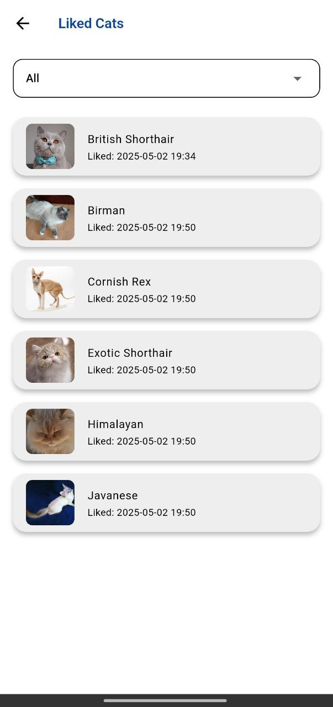

# cat_tinder

HSSE MIPT Flutter course HomeWork

## About

Simple Flutter app which allows you to swipe cats in "Tinder-like" form.

## Features

1. Random cats on main screen
2. Swipe left - dislike, swipe right - like
3. Swipe counter
4. Buttons with swipe functionality
5. Detail screen: info about breed and full info
6. New cats loading on end of current
7. Fulfilled readme.md

## Screens

## [Download](https://github.com/h4x4d/flutter-cat-tinder/blob/7a929bd4f870b563736b9981c3235ffae2d1bc88/release/cat-tinder-1.0.0.apk)
